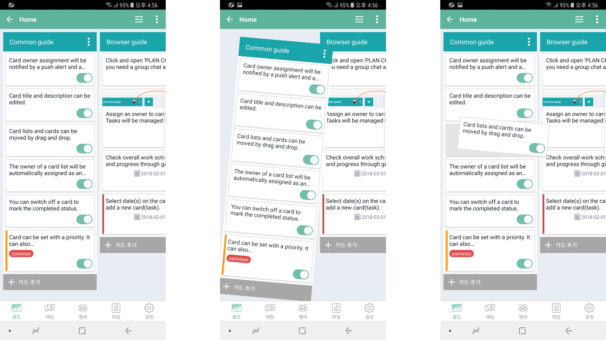
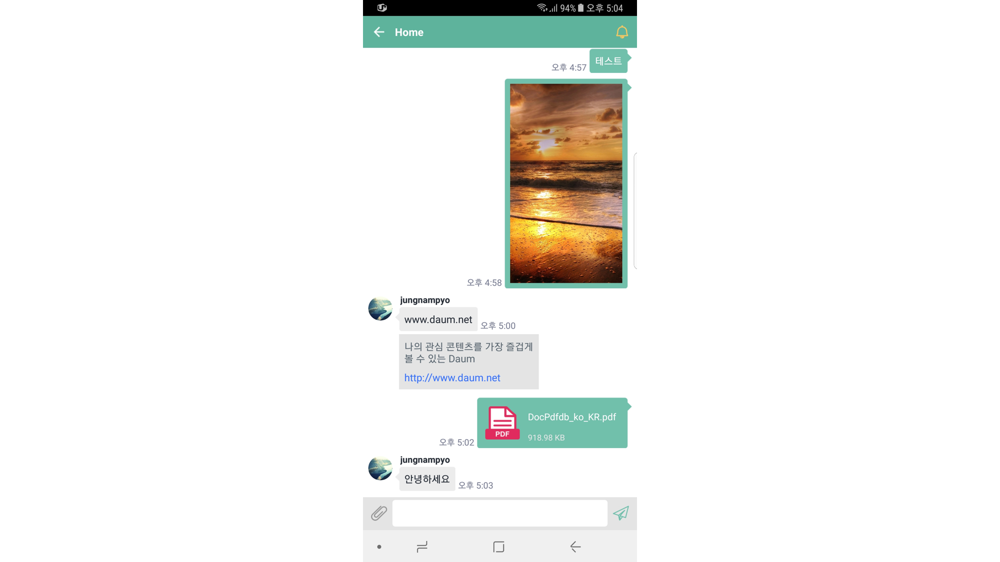
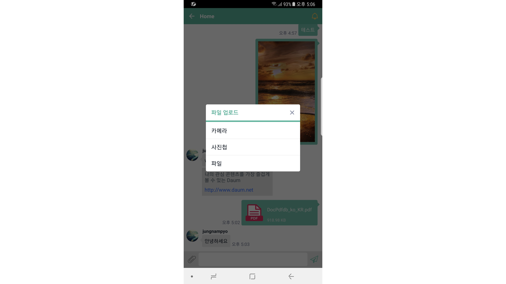

플랜그램
=======================

칸반보드와 채팅이 결합된 Task management system

- 2016.06.07. ~ 2018.04.06.
- Android, iOS, Java, Objective-C, Meteor, Mqtt, Realm, Glide, FCM, Google-OAuth

## 소개
칸반보드와 채팅이 결합된 서비스 Plangram의 모바일 앱 개발
> Android : 전체 개발
> iOS : 이미 개발된 앱을 인계받아 유지/보수

## 주요 기능
- 칸반보드
  - CardList/Card 드래그 등 각종 칸반보드 기능 구현

- 채팅
  - 메시지 전송, 첨부파일 전송, 오픈그래프 등 각종 기능 구현
  - Realm 이용해서 데이터 로컬 저장

- 실시간 Reactivity
  - Meteor, Mqtt 활용

- Google OAuth

- 파일 업/다운로드 기능
  - AWS S3에 직접 업로드

- 카메라 촬영
  - Intent 방식으로 카메라 촬영한 사진을 첨부파일로 업로드 하기

- Url scheme
  - 회원가입 인증, 팀 초대 메일에서 수락 버튼 누르면 앱이 실행되도록 설정

- 주소록에서 e-mail 목록 읽어오기
  - ContentResolver 사용해서 주소록에서 Email이 있는 목록만 표시
  - 팀 초대 email 입력할 때 사용하는 기능
